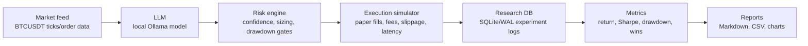

# NeuraTradeBench

Local LLM benchmark harness for BTC paper-trading research with Ollama, a dry-run execution simulator, risk controls, research logging, metrics, and reports.

## Testing And CI

[](https://github.com/sakshyambanjade/neuratrade/actions/workflows/ci.yml)

Local checks:

```bash
scripts/lint.sh
scripts/test.sh
```

The CI workflow runs Ruff, Black, mypy, and pytest with coverage.

## Architecture



More detail: [docs/architecture.md](docs/architecture.md).

## Quickstart With Ollama

Install backend dependencies:

```bash
cd backend
python -m venv .venv
source .venv/bin/activate
pip install -r requirements.txt
```

Install and start Ollama, then pull a local model:

```bash
ollama serve
ollama pull llama3.2:1b
```

Configure the backend:

```bash
cp .env.example .env
```

Set at least:

```env
OLLAMA_URL=http://127.0.0.1:11434
LLM_MODEL=llama3.2:1b
DB_PATH=trading.db
API_KEY=dev-key
```

Optional dashboard:

```bash
cd frontend
npm install
npm run dev
```

## Run A Live Dry-Run Experiment

Live experiments consume BTC market data, ask a local Ollama model for JSON decisions, pass the decision through risk gates, and simulate fills only. They do not place exchange orders.

From the repository root:

```bash
cd backend
python - <<'PY'
import asyncio
from experiments.run_live import LiveExperimentRunner, LiveRunConfig

config = LiveRunConfig(
    model_name="llama3.2:1b",
    symbol="BTCUSDT",
    experiment_name="btc-live-dry-run",
    cycle_interval_seconds=60,
    max_cycles=10,
    dry_run=True,
)

state = asyncio.run(LiveExperimentRunner(config).start())
print(state.model_dump())
PY
```

Use a short `max_cycles` value while testing. Omit it for a longer supervised run, and stop the process with `Ctrl-C`.

## Compare Models

Model comparison runs each local model against the same price series and ranks results by Sharpe ratio, drawdown, and return. When mocked decisions are not supplied, each model is queried through Ollama.

```bash
cd backend
python - <<'PY'
from experiments.compare_models import ModelComparisonConfig, compare_models

result = compare_models(
    ModelComparisonConfig(
        models=["llama3.2:1b", "tinyllama"],
        prices=[65000, 65120, 64980, 65340, 65210],
        output_csv_path="../artifacts/model_comparison.csv",
    )
)

print(result.model_dump_json(indent=2))
PY
```

## Run Ablations

Ablations isolate system components by comparing the full system with controlled variants such as no memory, no risk engine, no slippage, and no latency.

```bash
cd backend
python - <<'PY'
from experiments.ablation import AblationConfig, run_ablation

prices = [65000, 65120, 64980, 65340, 65210]
decisions = [
    {"action": "BUY", "confidence": 0.8, "position_size_pct": 0.2, "stop_loss": 0.02},
    "HOLD",
    {"action": "SELL", "confidence": 0.7, "position_size_pct": 0.5, "stop_loss": 0.02},
    "HOLD",
    "HOLD",
]

result = run_ablation(
    AblationConfig(
        prices=prices,
        decisions=decisions,
        output_dir="../artifacts",
    )
)

print(result.model_dump_json(indent=2))
PY
```

## Generate Reports

Reports are generated from experiment artifacts such as `model_comparison.csv`, `ablation_results.csv`, `ablation_summary.json`, charts, and config JSON files in the same output directory.

```bash
cd backend
python - <<'PY'
from reports.generate_report import generate_markdown_report

generate_markdown_report(
    experiment_id=1,
    output_md="../artifacts/report.md",
)
PY
```

The generated Markdown report includes configuration, model leaderboard, ablation table, key metrics, chart links, limitations, and reproducibility notes.

## Research Motivation

NeuraTradeBench is designed to study whether small local LLMs can produce consistent, measurable trading decisions when wrapped in deterministic research infrastructure. The goal is not to prove profitability. The goal is to make model behavior observable under repeatable BTC market conditions, quantify the effect of safety layers, and compare decision quality across local models and system variants.

The benchmark emphasizes:

- Local inference through Ollama instead of hosted model APIs.
- Paper-trading execution so experiments are safe and cheap to repeat.
- Logged prompts, decisions, risk events, fills, and metrics.
- Controlled ablations for risk, memory, slippage, and latency.
- Reproducible artifacts suitable for reports and research notes.

## Limitations

- BTC-only live evaluation is a narrow market sample.
- Short live windows can overfit to temporary market regimes.
- Simulated fills, fees, slippage, and latency are approximations.
- Local model outputs may vary by model build, prompt, hardware, and Ollama version.
- Paper-trading results are not evidence of real exchange performance.
- Risk rules reduce obvious failure modes but cannot make LLM decisions reliable.

## Safety Disclaimer

NeuraTradeBench is a simulator and paper-trading research system only. It is not financial advice, not an automated trading product, and not connected to real order placement in the live experiment path. Do not use benchmark output as a basis for real trading without independent validation, compliance review, and exchange-side risk controls.

## Documentation

- [Architecture](docs/architecture.md)
- [Methodology](docs/methodology.md)
- [Experiment Design](docs/experiment_design.md)
- [Metrics](docs/metrics.md)
- [Safety And Limits](docs/safety_and_limits.md)
- [Reproducibility](docs/reproducibility.md)
