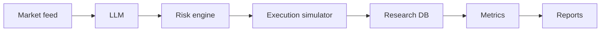

# Architecture

NeuraTradeBench is organized as a research pipeline:

## Market Feed

The market feed provides live BTC market snapshots, currently centered on `BTCUSDT`. A snapshot contains the latest price context used to build the model prompt, including bid, ask, spread, volume, and last price when available.

## LLM

The LLM layer uses a local Ollama model and asks for a strict JSON trading decision. The expected decision fields are action, confidence, position size, reasoning, stop loss, and take profit. Invalid or unavailable model responses fall back to a safe `HOLD` decision.

## Risk Engine

The risk engine validates model intent before a simulated order is allowed. It checks confidence, position sizing, drawdown, spread, volatility, stop-loss shape, and loss streak context. The risk layer can block, downsize, or pass a decision.

## Execution Simulator

The execution simulator turns approved decisions into paper fills. It models balances, fees, spread/slippage, latency, fill status, average fill price, and realized PnL. It never submits live exchange orders.

## Research DB

The research database stores experiment metadata, model runs, inference logs, risk events, simulated fills, and metric snapshots. The default backend is SQLite with WAL mode for local research runs.

## Metrics

Metrics convert equity and trade series into comparable results, including return, Sharpe, Sortino, max drawdown, win rate, profit factor, latency, and slippage.

## Reports

Reports summarize generated artifacts into Markdown, including configuration, model leaderboards, ablation tables, key metrics, chart links, limitations, and reproducibility notes.
